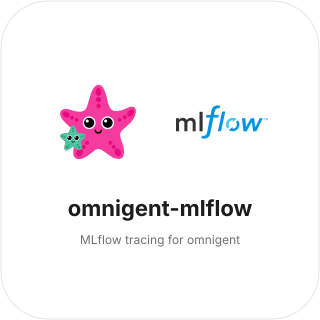
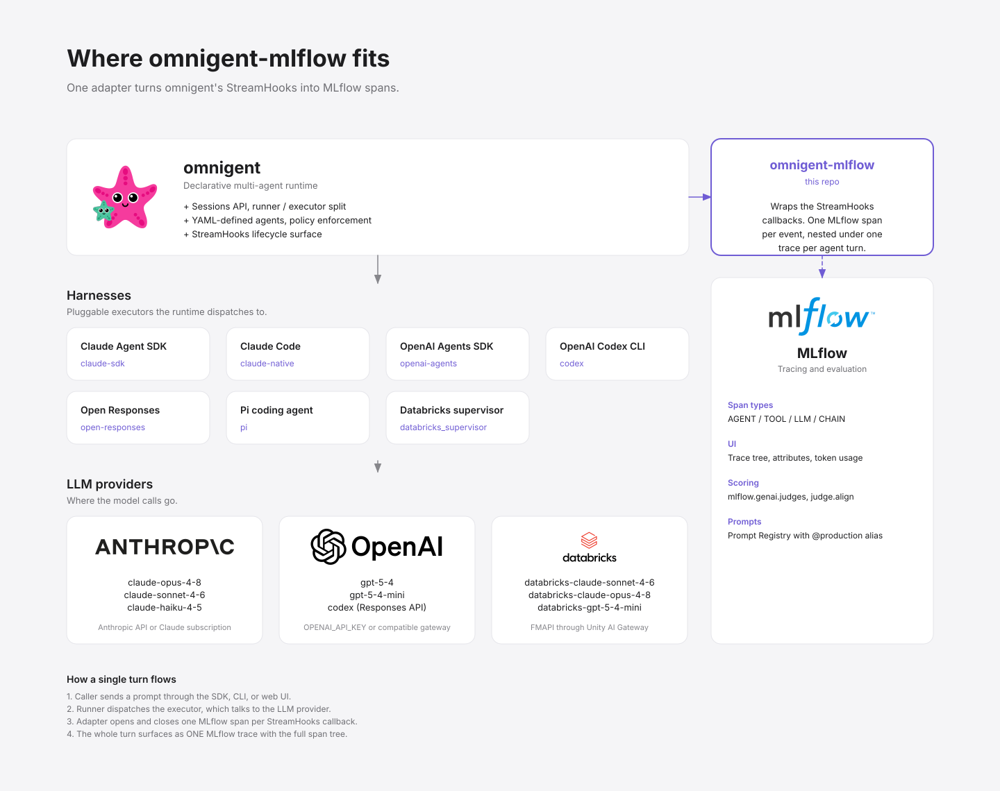
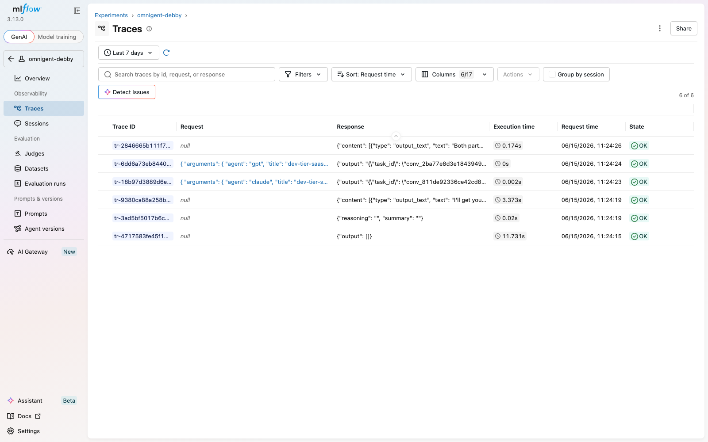
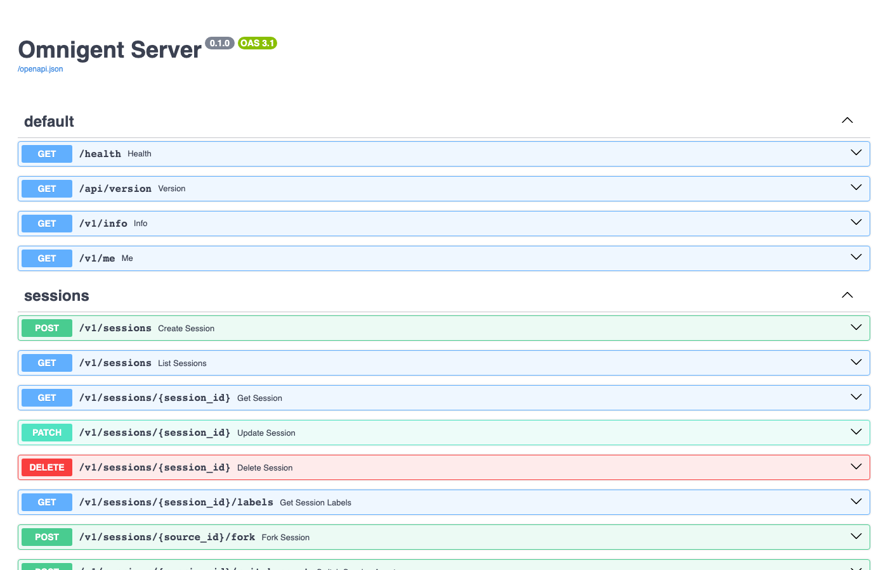

<p align="center">
  
</p>

# omnigent-mlflow

[](https://github.com/debu-sinha/omnigent-mlflow-quickstart/actions/workflows/ci.yml)
[](LICENSE)
[](#install)

MLflow tracing for [omnigent](https://github.com/omnigent-ai/omnigent)
sessions. Attach `OmnigentMlflowHooks` to a session and every
`StreamHooks` callback becomes an MLflow span, all nested under one
trace per turn.



## What this connects

If you're new to either side:

**omnigent** is a multi-agent runtime that Databricks open-sourced.
You write an agent as a short YAML file (a prompt, an executor, an
optional list of sub-agents the supervisor can delegate to) and
omnigent runs it across terminal, web, native app, mobile, and a REST
API. The bundled `debby` example fans every question out to a Claude
sub-agent and a GPT sub-agent in parallel and synthesises the answers.

**MLflow Tracing** is the GenAI observability surface in MLflow. It
gives you span-based traces (AGENT / TOOL / LLM / CHAIN), a UI to
explore them, `judge.align` for LLM-as-judge scoring, and the Prompt
Registry. Self-host it, run it on Databricks, or use the OSS server.

**omnigent-mlflow** is the seam between them. Every `StreamHooks`
callback omnigent emits during a session (response start/end, tool
call start/end, reasoning, messages, file outputs, elicitations)
becomes one MLflow span, with every child correctly nested under its
parent so the whole turn surfaces as one trace.

## Five minutes from clone to first trace

The complete runnable walkthrough lives in
[`examples/trace_debby.py`](examples/trace_debby.py). It bundles an
agent directory, posts it through `sessions_chat`, binds a runner,
streams the turn, and emits MLflow spans. Run it like this:

```bash
# 1. Install omnigent + the adapter
pip install omnigent omnigent-mlflow

# 2. Configure providers (one-time)
omni setup     # interactive; sets ANTHROPIC + OPENAI keys

# 3. Start the omnigent server (leave running in one terminal)
omni debby

# 4. In another terminal, run the example against the bundled debby
export MLFLOW_TRACKING_URI=sqlite:///mlflow.db
export OMNIGENT_SERVER=http://localhost:6767
export OMNIGENT_AGENT_PATH=$(omni debug agent-path debby)
python examples/trace_debby.py "design a pricing tier"

# 5. Open the MLflow UI and click the trace
mlflow ui --backend-store-uri sqlite:///mlflow.db
```

The integration itself, once everything is running, is the four-line
attach pattern:

```python
from omnigent_client import OmnigentClient
from omnigent_mlflow import OmnigentMlflowHooks

hooks = OmnigentMlflowHooks(experiment="my-agent")
chat = await client.sessions_chat(bundle=bundle, hooks=hooks.stream_hooks())
```

`bundle` is the gzipped tarball of your agent directory (see
`_bundle_agent` in `examples/trace_debby.py` for a 10-line helper).

## Install

```bash
pip install omnigent-mlflow
```

Requires `omnigent>=0.1` and `mlflow>=3.0`. Both are declared in
`pyproject.toml` so they get pulled in automatically.

## Span mapping

Each omnigent `StreamHooks` callback maps to one MLflow span:

| omnigent hook | MLflow span name | span type |
| --- | --- | --- |
| `on_response_start` / `on_response_end` | `agent.<model>` | `AGENT` |
| `on_tool_call_start` / `on_tool_call_end` | `tool.<name>` | `TOOL` |
| `on_message_start` / `on_message_end` | `llm.message` | `LLM` |
| `on_reasoning_start` / `on_reasoning_end` | `reasoning` | `CHAIN` |
| `on_compaction_start` / `on_compaction_end` | `compaction` | `CHAIN` |
| `on_sub_agent_spawned` / `on_sub_agent_completed` | `sub_agent.<name>` | `AGENT` |
| `on_retry`, `on_server_error` | annotation on the open span | n/a |

Tool spans carry their `arguments` as inputs and `output` as outputs.
Response and sub-agent spans carry token usage on the matching `_end`.
Retries annotate every currently-open span with attempt counts.

For PII-sensitive workloads, disable payload capture and you'll keep
only the structural signal:

```python
OmnigentMlflowHooks(capture_inputs=False, capture_outputs=False)
```

## Worked example

`examples/trace_debby.py` runs the bundled debby agent end to end
against an omnigent server you already have running, and emits a real
MLflow trace.

```bash
# In one terminal: an omnigent server with the debby agent loaded
omni debby

# In another terminal: stream a turn through the adapter
export OMNIGENT_SERVER=http://localhost:6767
export OMNIGENT_AGENT_PATH=/path/to/omnigent/examples/debby
export MLFLOW_TRACKING_URI=sqlite:///mlflow.db
python examples/trace_debby.py "design a pricing tier"

# Then open the MLflow UI
mlflow ui --backend-store-uri sqlite:///mlflow.db
```

A real Debby turn produces one MLflow trace with six nested spans:
the `agent.debby` root, a `reasoning` span, two `tool.sys_session_send`
calls dispatching to the Claude and GPT sub-agents, and two
`llm.message` spans for the orchestrator's opening and closing
messages. The Details + Timeline tab shows the tree:



Same trace from the list view:


And the omnigent server it ran against:



## Scoring traces

`omnigent_mlflow.judges` ships two examples:

* `tool_call_efficiency` walks the span tree and flags duplicate
  tool calls (same name + same arguments). Code-only, cheap to run on
  every trace.
* `debate_synthesis_quality` looks at a Debby trace, pulls the two
  sub-agent outputs and the orchestrator's synthesis, and asks a
  judge model whether the synthesis fairly attributes positions and
  surfaces real disagreement.

Wire them up with `mlflow.genai.scorers` to run on every trace.

## Status and open issues

Alpha. The adapter pairs with these upstream changes:

* omnigent [#43](https://github.com/omnigent-ai/omnigent/pull/43)
  added `StreamHooks` support to `SessionsChat`. Without it, hooks
  do not fire on the sessions-first API.
* omnigent [#149](https://github.com/omnigent-ai/omnigent/pull/149)
  fixed a circular import that blocked server startup on a fresh
  install of main.

Still open:

* omnigent [#146](https://github.com/omnigent-ai/omnigent/issues/146)
  observes that `StreamHooks.on_sub_agent_spawned` /
  `on_sub_agent_completed` are declared but never fired. Sub-agent
  spans won't appear in the trace tree until those callbacks are
  wired.
* The pure-SDK example has to PATCH a `runner_id` onto a freshly-
  created session before `send()` works. The omnigent CLI does this
  implicitly via `omni run`. The SDK doesn't have a helper for it
  yet, so `examples/trace_debby.py` does it explicitly.

## Tests

```bash
pytest -q
```

Five unit tests cover the lifecycle pairing, attribute extraction,
parallel sub-agent handling, PII redaction flags, and unknown-end-
event handling. They use `SimpleNamespace`-shaped context objects so
they run without a live omnigent server.

## License

Apache 2.0. See `LICENSE`.
